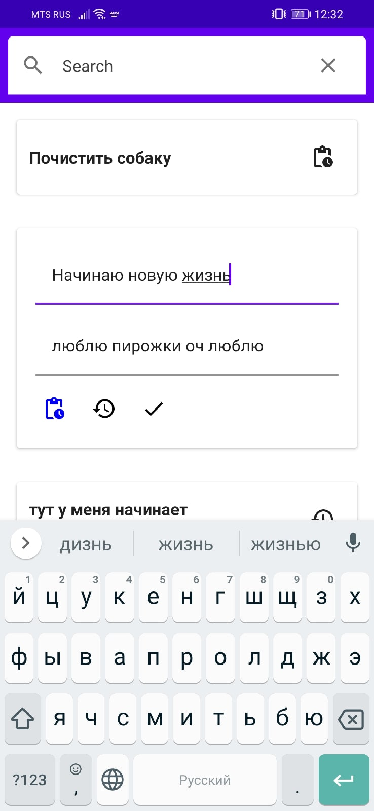
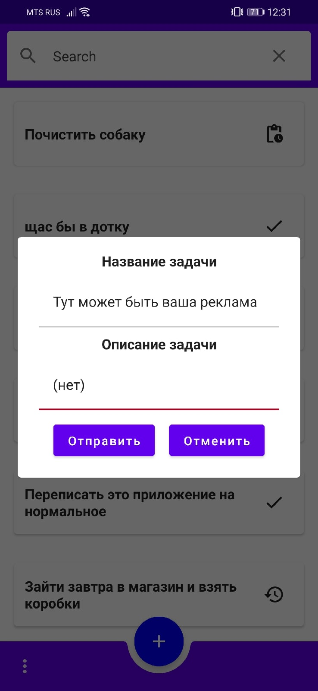
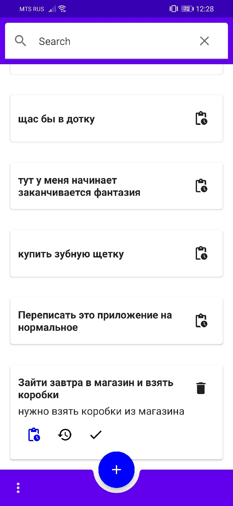

# Данное приложение представляет собой тестовую работу для изучение возможностей Jetpack Compose

## Используемые технологии и архитектурные подходы

* MVVM
* JetpackCompose
* Repository 
* LiveData

### Краткое описание

Проект представляет собой простейший лист для ведение заметок. UI полностью написан на JetpackCompose
Для хранение заметок используется чистый Sqlite
В качестве посредника между ViewModel и классом управления субд выступает репозиторий, интерфейс которого описан в пакете data.repository.TaskRepository
Для редактирование заметки, необходимо длительное нажатие на элемент. Изменение происходят автоматически

Данная работа делалась лишь для того, чтобы попробывать возможности, которые предоставляет нам средство, для написание декларативного UI для android
В приложении имеются баги. Часть из-за моей лени, часть из-за сырости самого JetpackCompose и небольшого количество информации, которую я смог найти в интернете

Так, если у вас есть хорошая статья как работать с фокусом или с инсетами, то, пожалуйста, дайте обратную связь. Контакты у меня в профиле
P.s я знаю о https://chrisbanes.github.io/accompanist/insets/

  
